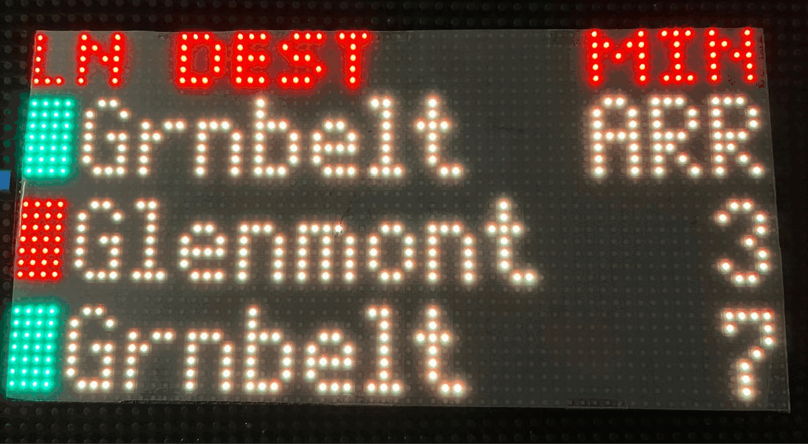
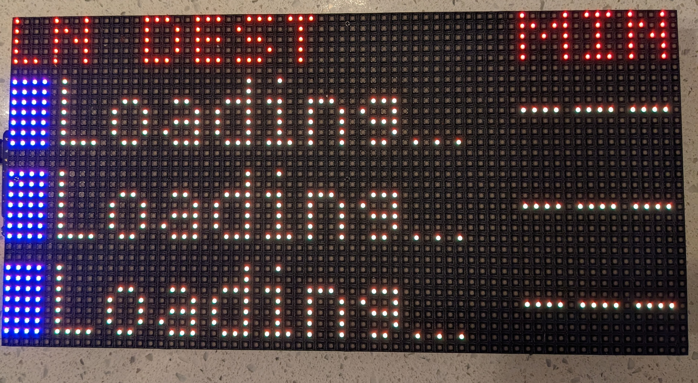
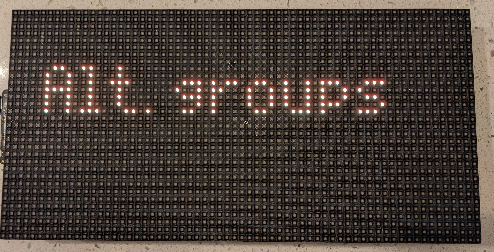

A fork from [erikrrodriguez's metro-sign](https://github.com/erikrrodriguez/dc-metro) (based on [metro-sign](https://github.com/metro-sign/dc-metro)) which adds button functionality.

Adds:
- Button support to hide the top banner and allow 4 trains to show
- Button support to switch between alternating groups, showing two groups, or one at a time
- New fonts

Based on:
- Forked from erikrrodriguez, who included:
    - Walking distance modifier
    - Updated to CircutPython 8
    - Incorporated [scottiecarcia's](https://github.com/scottiegarcia/dc-metro) off-hours and Metrohero API
    - Incorporated [ScottKekoaShay's](https://github.com/ScottKekoaShay/dc-metro) auto-swapping of stations
- Also used [GJT-34's](https://github.com/GJT-34/dc-metro) awesome Metroesque.bdf font

# Washington DC Metro Train Sign
This project contains the source code to create your own Washington DC Metro sign. It was written using CircuitPython targeting the [Adafruit Matrix Portal](https://www.adafruit.com/product/4745) and is optimized for 64x32 RGB LED matrices.

# How To
## Hardware
- An [Adafruit Matrix Portal](https://www.adafruit.com/product/4745) - $24.99
- A **64x32 RGB LED matrix** compatible with the _Matrix Portal_ - $39.99 _to_ $84.99
    - [64x32 RGB LED Matrix - 3mm pitch](https://www.adafruit.com/product/2279)
    - [64x32 RGB LED Matrix - 4mm pitch](https://www.adafruit.com/product/2278)
    - [64x32 RGB LED Matrix - 5mm pitch](https://www.adafruit.com/product/2277)
    - [64x32 RGB LED Matrix - 6mm pitch](https://www.adafruit.com/product/2276)
- A **USB-C power supply** (15w phone adapters should work fine for this code, but the panels can theoretically pull 20w if every pixel is on white)
- A **USB-C cable** that can connect your computer/power supply to the board

## Tools
- A small phillips head screwdriver
- A hot glue gun _(optional)_
- Tape _(optional)_

## Part 1: Prepare the Board
1. Use a hot glue gun to cover the sharp screws on the right-hand side of the 64x32 LED matrix. This step is optional, but it will prevent wire chafing later on.

    

2. Lightly screw in the phillips head screws into the posts on the _Matrix Portal_. These only need to go down about 60% of the way.

    

3. Using the power cable provided with 64x32 matrix, slide the prong for the **red power cable** between the post and the screw on the port labeled **5v**. Tighten down this screw all the way using your screwdriver. Repeat the same for the **black power cable** and the **GND** port.

    
    

4. Connect the _Matrix Portal_ to the large connector on the left-hand side of the back of the 64x32 matrix.

    

5. Plug one of the power connectors into the right-hand side of the 64x32 matrix.

    

6. You can use masking tape (or painter's tape) to prevent the cables from flopping around.

    

## Part 2: Loading the Software
1. Connect the board to your computer using a USB C cable. Double click the button on the board labeled _RESET_. The board should mount onto your computer as a storage volume, most likely named _MATRIXBOOT_.
    
    

2. Flash your _Matrix Portal_ with the latest release of CircuitPython 8.
    - Download the [firmware from Adafruit](https://circuitpython.org/board/matrixportal_m4/).
    - Drag the downloaded _.uf2_ file into the root of the _MATRIXBOOT_ volume.
    - The board will automatically flash the version of CircuitPython and remount as _CIRCUITPY_.
    - If something goes wrong, refer to the [Adafruit Documentation](https://learn.adafruit.com/adafruit-matrixportal-m4/install-circuitpython).

3. Decompress the _lib.zip_ file for 8.x from this repository into the root of the _CIRCUITPY_ volume. There should be one folder named _lib_, with a plethora of files underneath. You can delete _lib.zip_ from the _CIRCUITPY_ volume, as it's no longer needed.

    - It has been reported that this step may fail ([Issue #2](https://github.com/metro-sign/dc-metro/issues/2)), most likely due to the storage on the Matrix Portal not being able to handle the decompression. If this happens, unzip the _lib.zip_ file on your computer, and copy the _lib_ folder to the Matrix Portal. Command line tools could also be used if the above doesn't work.

    

4. Copy all of the Python files from _src_ in this repository into the root of the _CIRCUITPY_ volume. Also copy the two _*.bdf_ files into the the _lib_

    

5. The board should now light up with a loading screen, but we've still got some work to do.

    

## Part 3: Getting a WMATA / Metro Hero API Key
Two API's are available with public metro data. The Official WMATA API and the MetroHero API. Either will work, but I opt for the latter because I think it's train times are more accurate and because it gives estimates for trains >30 minutes away. Either will work correctly, at least until Metrohero sunsets in July 2023, RIP.

### Part 3.a: Getting a WMATA API Key
1. Create a WMATA developer account on [WMATA's Developer Website](https://developer.wmata.com/signup/).
2. After your account is created, add the _Default Tier_ subscription to your account on [this page](https://developer.wmata.com/products/5475f1b0031f590f380924fe).
3. After doing this, you will be redirected to [your profile](https://developer.wmata.com/developer).
4. Under the _Subscriptions_ section on your profile, select the **show** button beside the _Primary Key_. This is the key that allows the board to communicate with WMATA.

### Part 3.b: Getting a Metro Hero Key
1. Send an polite email to contact@dcmetrohero.com asking for an API Key. [MetroHero's Developer Website](https://www.dcmetrohero.com/apis).
2. Wait patiently for their reply with your API key.

## Part 4: (Optional) Obtain adafruit IO Key for Off Hours.
If you'd like to configure your board to turn the display off for certain hours of the day, you'll need to set up a free account with Adafruit to make requests for the local time. You may skip this if you are not interested in this feature.

1. Follow steps 1-3 outlined [here](https://learn.adafruit.com/adafruit-magtag/getting-the-date-time).
2. Make note of your username and your Adafruit IO key.

## Part 5: Configuring the Board
1. Open the [secrets.py](src/secrets.py) file located in the root of the _CIRCUITPY_ volume.
    1. Fill in your WiFi _ssid_ and _password_.
    2. Set either the _wmata_api_key_ or _metro_hero_api_key_ to the API key you got from [Part 3](#part-3-getting-a-wmata-/-metro-hero-api-key).
2. Open the [config.py](src/config.py) file located in the root of the _CIRCUITPY_ volumse.
    1. If using MetroHero, update the _source_api_ field to `MetroHero`.
    2. Select your stations and lines from the [Metro Station Codes table](#dc-metro-station-codes), and set the _metro_station_codes_ value to the corresponding value in the table.
    3. For _train_groups_1_, the values need to be either **'1'** or **'2'** or  **'3'**. This determines which platform's arrival times will be displayed. These typically fall in line with the values provided in the [Train Group table](#train-group-explanations), although single tracking and other events can cause these to change. The ordering must match the ordering used in _metro_station_codes_. 
    4. Set the _walking_times_ values to the time it takes you to get to these stations. This will make your sign ignore trains arriving in less than this much time.
4. (Optional) Under the **Off Hours Configuration** section:
    1. Set _aio_username_ to the username you created with Adafruit in [Part 4]((optional)-obtain-adafruit-io-key-for-off-hours).
    2. Set _aio_key_ to the api key associated with your Adafruit account.
    3. Set the _display_on_time_ and _display_off_time_ variables to the time of day you would like the sign to be turned off and on. Note that they must be of the format "HH:MM" and use a 24 hour clock.
5. After you save these files, your board should refresh and connect to WMATA.

## Part 6: Using the Board
### Powering on
1. The board will automatically run the metro code on every power-up, by plugging in any USB-C cable.

### Using the buttons
1. You can change between showing three of four lines of trains (with and without the heading text) by pressing the **'UP'** button on the board. This is shown below

2. You can also change which train groups to show by pressing the **'DOWN'** button the board. The modes will cycle as follows:

| Mode          | Shows         |
|---------------|---------------|
| Both groups   | Both train groups at once (merged, sorted by earliest) |
| Alt.groups    | Alternate between groups every few seconds |
| Group 1       | Shows only the first group set in config.py |
| Group 2       | Shows only the second group set in config.py |

After you press the DOWN button, wait for the text to show to confirm the change

## Troubleshooting
If something goes wrong, take a peek at the [Adafruit Documentation](https://learn.adafruit.com/adafruit-matrixportal-m4). Additionally, you can connect to the board using a [serial connection](https://learn.adafruit.com/welcome-to-circuitpython/kattni-connecting-to-the-serial-console) to gain access to its logging.

# Appendix
## DC Metro Station Codes
| Name                                             | Lines      | Code |
|--------------------------------------------------|------------|------|
| Addison Road-Seat Pleasant                       | BL, SV     | G03  |
| Anacostia                                        | GR         | F06  |
| Archives-Navy Memorial-Penn Quarter              | GR, YL     | F02  |
| Arlington Cemetery                               | BL         | C06  |
| Ballston-MU                                      | OR, SV     | K04  |
| Benning Road                                     | BL, SV     | G01  |
| Bethesda                                         | RD         | A09  |
| Braddock Road                                    | BL, YL     | C12  |
| Branch Ave                                       | GR         | F11  |
| Brookland-CUA                                    | RD         | B05  |
| Capitol Heights                                  | BL, SV     | G02  |
| Capitol South                                    | BL, OR, SV | D05  |
| Cheverly                                         | OR         | D11  |
| Clarendon                                        | OR, SV     | K02  |
| Cleveland Park                                   | RD         | A05  |
| College Park-U of Md                             | GR         | E09  |
| Columbia Heights                                 | GR, YL     | E04  |
| Congress Heights                                 | GR         | F07  |
| Court House                                      | OR, SV     | K01  |
| Crystal City                                     | BL, YL     | C09  |
| Deanwood                                         | OR         | D10  |
| Dunn Loring-Merrifield                           | OR         | K07  |
| Dupont Circle                                    | RD         | A03  |
| East Falls Church                                | OR, SV     | K05  |
| Eastern Market                                   | BL, OR, SV | D06  |
| Eisenhower Avenue                                | YL         | C14  |
| Farragut North                                   | RD         | A02  |
| Farragut West                                    | BL, OR, SV | C03  |
| Federal Center SW                                | BL, OR, SV | D04  |
| Federal Triangle                                 | BL, OR, SV | D01  |
| Foggy Bottom-GWU                                 | BL, OR, SV | C04  |
| Forest Glen                                      | RD         | B09  |
| Fort Totten                                      | RD         | B06  |
| Fort Totten                                      | GR, YL     | E06  |
| Franconia-Springfield                            | BL         | J03  |
| Friendship Heights                               | RD         | A08  |
| Gallery Pl-Chinatown                             | RD         | B01  |
| Gallery Pl-Chinatown                             | GR, YL     | F01  |
| Georgia Ave-Petworth                             | GR, YL     | E05  |
| Glenmont                                         | RD         | B11  |
| Greenbelt                                        | GR         | E10  |
| Greensboro                                       | SV         | N03  |
| Grosvenor-Strathmore                             | RD         | A11  |
| Huntington                                       | YL         | C15  |
| Judiciary Square                                 | RD         | B02  |
| King St-Old Town                                 | BL, YL     | C13  |
| L'Enfant Plaza                                   | BL, OR, SV | D03  |
| L'Enfant Plaza                                   | GR, YL     | F03  |
| Landover                                         | OR         | D12  |
| Largo Town Center                                | BL, SV     | G05  |
| McLean                                           | SV         | N01  |
| McPherson Square                                 | BL, OR, SV | C02  |
| Medical Center                                   | RD         | A10  |
| Metro Center                                     | RD         | A01  |
| Metro Center                                     | BL, OR, SV | C01  |
| Minnesota Ave                                    | OR         | D09  |
| Morgan Boulevard                                 | BL, SV     | G04  |
| Mt Vernon Sq 7th St-Convention Center            | GR, YL     | E01  |
| Navy Yard-Ballpark                               | GR         | F05  |
| Naylor Road                                      | GR         | F09  |
| New Carrollton                                   | OR         | D13  |
| NoMa-Gallaudet U                                 | RD         | B35  |
| Pentagon                                         | BL, YL     | C07  |
| Pentagon City                                    | BL, YL     | C08  |
| Potomac Ave                                      | BL, OR, SV | D07  |
| Prince George's Plaza                            | GR         | E08  |
| Rhode Island Ave-Brentwood                       | RD         | B04  |
| Rockville                                        | RD         | A14  |
| Ronald Reagan Washington National Airport        | BL, YL     | C10  |
| Rosslyn                                          | BL, OR, SV | C05  |
| Shady Grove                                      | RD         | A15  |
| Shaw-Howard U                                    | GR, YL     | E02  |
| Silver Spring                                    | RD         | B08  |
| Smithsonian                                      | BL, OR, SV | D02  |
| Southern Avenue                                  | GR         | F08  |
| Spring Hill                                      | SV         | N04  |
| Stadium-Armory                                   | BL, OR, SV | D08  |
| Suitland                                         | GR         | F10  |
| Takoma                                           | RD         | B07  |
| Tenleytown-AU                                    | RD         | A07  |
| Twinbrook                                        | RD         | A13  |
| Tysons Corner                                    | SV         | N02  |
| U Street/African-Amer Civil War Memorial/Cardozo | GR, YL     | E03  |
| Union Station                                    | RD         | B03  |
| Van Dorn Street                                  | BL         | J02  |
| Van Ness-UDC                                     | RD         | A06  |
| Vienna/Fairfax-GMU                               | OR         | K08  |
| Virginia Square-GMU                              | OR, SV     | K03  |
| Waterfront                                       | GR         | F04  |
| West Falls Church-VT/UVA                         | OR         | K06  |
| West Hyattsville                                 | GR         | E07  |
| Wheaton                                          | RD         | B10  |
| White Flint                                      | RD         | A12  |
| Wiehle-Reston East                               | SV         | N06  |
| Woodley Park-Zoo/Adams Morgan                    | RD         | A04  |

## DC Metro Silver Line Phase II Stations
A special thanks to [u/SandBoxJohn](https://www.reddit.com/user/SandBoxJohn) for these.
| Name                                             | Lines      | Code |
|--------------------------------------------------|------------|------|
| Reston Town Center                               | SV         | N07  |
| Herndon                                          | SV         | N08  |
| Innovation Center                                | SV         | N09  |
| Dulles Airport                                   | SV         | N10  |
| Loudoun Gateway                                  | SV         | N11  |
| Ashburn                                          | SV         | N12  |

## Train Group Explanations
A special thanks to [u/SandBoxJohn](https://www.reddit.com/user/SandBoxJohn) for these.
| Line       | Train Group | Destination                                            |
|------------|-------------|--------------------------------------------------------|
| RD         | "1"         | Glenmont                                               |
| RD         | "2"         | Shady Grove                                            |
| BL, OR, SV | "1"         | New Carrollton, Largo Town Center                      |
| BL, OR, SV | "2"         | Vienna, Franconia-Springfield, Wiehle-Reston East      |
| GR, YL     | "1"         | Greenbelt                                              |
| GR, YL     | "2"         | Huntington, Branch Avenue                              |
| N/A        | "3"         | Center Platform at National Airport, West Falls Church |
